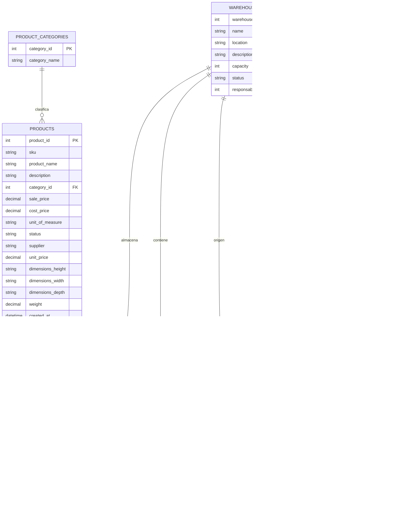

# Modelo Entidad-Relación (MER)

## Módulo de Logística e Inventario

El siguiente diagrama representa las siete entidades del módulo, sus atributos y las relaciones entre ellas.

```mermaid
erDiagram
    PRODUCT_CATEGORIES {
        int category_id PK
        string category_name
    }

    PRODUCTS {
        int product_id PK
        string sku
        string product_name
        string description
        int category_id FK
        decimal sale_price
        decimal cost_price
        string unit_of_measure
        string status
        string supplier
        decimal unit_price
        string dimensions_height
        string dimensions_width
        string dimensions_depth
        decimal weight
        datetime created_at
        datetime updated_at
        int created_by FK
        int updated_by FK
    }

    WAREHOUSES {
        int warehouse_id PK
        string name
        string location
        string description
        int capacity
        string status
        int responsable_id FK
    }

    USERS {
        int user_id PK
        string user_name
        string role
        string email
        int assigned_warehouse_id FK
    }

    STOCK {
        int stock_id PK
        int product_id FK
        int warehouse_id FK
        int quantity_available
        int min_stock_level
        date expiration_date
        date update_date
    }

    INVENTORY_TRANSACTIONS {
        int transaction_id PK
        int product_id FK
        int warehouse_id FK
        string transaction_type
        int quantity
        int user_id FK
        date transaction_date
    }

    STOCK_TRANSFERS {
        int transfer_id PK
        int product_id FK
        int source_warehouse_id FK
        int target_warehouse_id FK
        int quantity
        string status
        date transfer_date
        int created_by FK
        int confirmed_by FK
    }

    PRODUCT_CATEGORIES ||--o{ PRODUCTS : clasifica
    PRODUCTS ||--o{ STOCK : tiene
    WAREHOUSES ||--o{ STOCK : almacena
    PRODUCTS ||--o{ INVENTORY_TRANSACTIONS : registra
    WAREHOUSES ||--o{ INVENTORY_TRANSACTIONS : contiene
    USERS ||--o{ INVENTORY_TRANSACTIONS : realiza
    PRODUCTS ||--o{ STOCK_TRANSFERS : transfiere
    WAREHOUSES ||--o{ STOCK_TRANSFERS : origen
    WAREHOUSES ||--o{ STOCK_TRANSFERS : destino
    USERS |o--o{ WAREHOUSES : responsable
    WAREHOUSES |o--o{ USERS : asignados
    USERS ||--o{ STOCK_TRANSFERS : crea
    USERS |o--o{ STOCK_TRANSFERS : confirma
```

## Restricciones adicionales

- `PRODUCTS.category_id` es obligatorio (cada producto debe pertenecer a una categoría existente).
- `PRODUCTS.sku` es obligatorio y único.
- `WAREHOUSES.name` es obligatorio y único.
- `WAREHOUSES.status` solo admite los valores "activo" o "inactivo".
- En `STOCK`, la combinación (`product_id`, `warehouse_id`) debe ser única; solo puede existir un registro por producto y bodega.
- `INVENTORY_TRANSACTIONS.transaction_type` solo admite los valores "entrada", "salida", "ajuste_entrada" o "ajuste_salida".
- `STOCK_TRANSFERS.status` solo admite los valores "pendiente", "confirmada" o "cancelada".
- `STOCK_TRANSFERS.created_by` es obligatorio y registra al usuario que crea la solicitud.
- `STOCK_TRANSFERS.confirmed_by` es obligatorio cuando la transferencia pasa a estado "confirmada".
- `PRODUCTS.unit_price` se conserva solo por compatibilidad con la plantilla base; las reglas de negocio usan `sale_price` y `cost_price`.
- `STOCK.min_stock_level` y `STOCK.expiration_date` quedan reservados para iteraciones futuras; no se calculan alertas ni vencimientos en esta iteración.
- `WAREHOUSES.responsable_id` identifica al responsable principal de la bodega; `USERS.assigned_warehouse_id` identifica la bodega operativa asignada al usuario.

## Referencia visual

El MER original elaborado por nuestro grupo se conserva como referencia visual.

